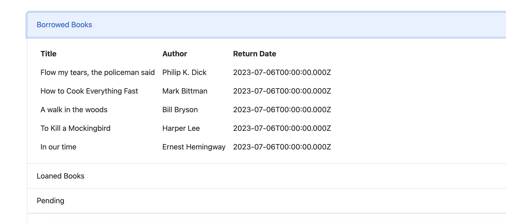
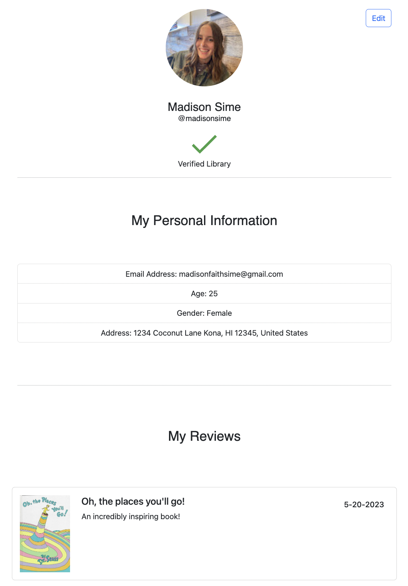
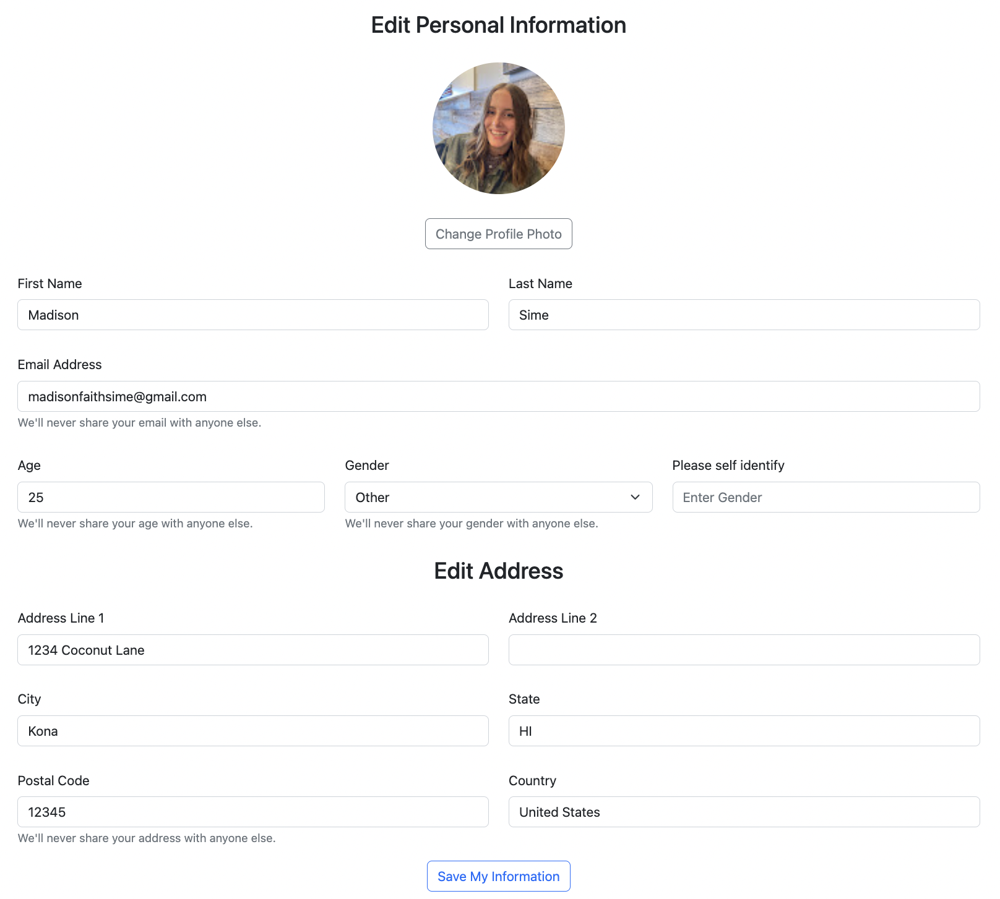
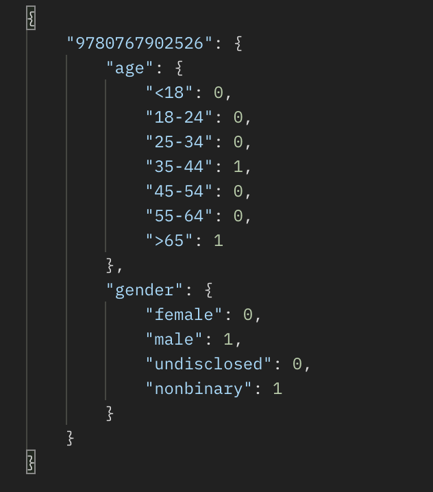
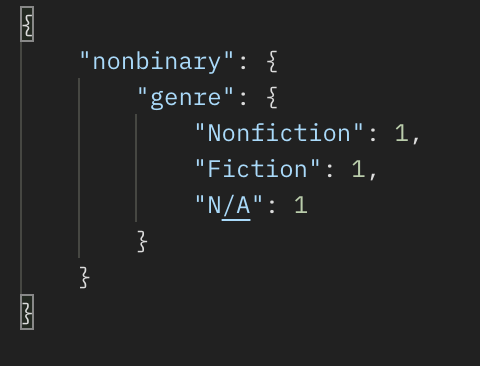
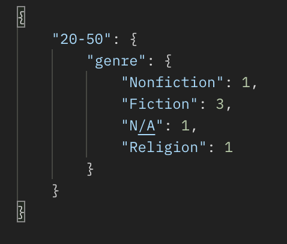

# ShelfShare

The only completely crowd-sourced book borrowing platform.

 

##  The Basement Eels
- CJ Edgecombe (Usage API)
- Fig Fishkin (Home Page)
- Guillermo Hasbun (Orders)
- Kevin Hoang (User Authentication)
- Maddie Sime (Profile Pages, Reviews)
- Melodie Peck (Personal Library)

 

## Features

1. **Google Authentication**

Users that are not signed in, will click on the sign in button. Users will then sign in with Google. If the user has an account already made, it will load their information and be redirected to the home page. If the user does not have an account, they will provide more demographic information and once that is completed.. They will be sent back to the home page.

 

2. **Home Page**

 

3. **Orders**

A registered user would be notified of any of their books being requested by another user. The notification will provide them with the distribution center (DC) shipping address, keeping in line with anonymity.

Users can also navigate to their profile, and go to the Orders section. The Orders feature will display the books borrowed from other registered users, and the books loaned out to other registered users. They will also be able to see the expected ship to owner date(s) and expected return date(s).

The orders will also display orders that are pending shipment. After the user has dropped off the book to a parcel carrier, they can click the confirmation button to update the order to the loaned list.

   

 

4. **Profile**

The information collected via Google Authentication flows through the system and into the user's personal profile page. Upon visiting their personal profile page, a user will see their information (profile photo, name, username, verification of library status if the account belongs to a library establishment, details like email, age, gender, address, and a list of the reviews the user has left on books). The user has the ability to edit their information to keep it updated.

Navigating to the detail page for a book on the homepage leads the user to a list of reviews for the selected book. The user can post their own reviews here. Clicking on the username of a review takes the user to the selected user's public-facing profile page which shows basic information about that user (profile photo, name, username), a list of reviews that user has left on books, and that user's shelf (or books they are lending out for borrowing).

 

5. **Library**

 

6. **API**

The usage API is a convenient way to access user and book trend data. There are two endpoints: `usage/books/` and `/usage/genre`.

To get information about a specific book, send a request to the books endpoint, including the ISBN of the title in question as a url paramater. For example, a request like this:

`/usage/books/?isbn=9780767902526`

Would return an object like this:

To get genre trend information based on user demographics, send a request to the genre endpoint, including the demographic type and demopgraphic selection as url parameters. For example, a request like this:

`/usage/genre/?demo=gender&select=nonbinary`

Would return an object like this:

When selecting for an age, please include a range. For example:

`/usage/genre/?demo=age&select=20-50`

Would return and object like this:

 